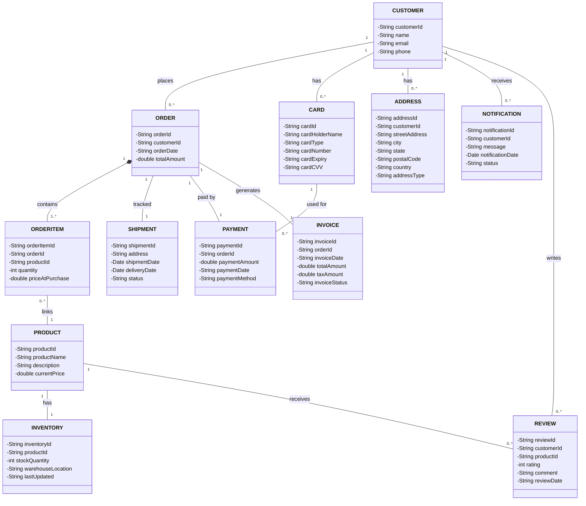

### System Architecture

```mermaid
classDiagram
    class CUSTOMER {
        -String customerId
        -String name
        -String email
        -String phone
    }
    class ADDRESS {
        -String addressId
        -String customerId
        -String streetAddress
        -String city
        -String state
        -String postalCode
        -String country
        -String addressType
    }
    class ORDER {
        -String orderId
        -String customerId
        -String orderDate
        -double totalAmount
    }
    class ORDERITEM {
        -String orderItemId
        -String orderId
        -String productId
        -int quantity
        -double priceAtPurchase
    }
    class PRODUCT {
        -String productId
        -String productName
        -String description
        -double currentPrice
    }
    class INVENTORY {
        -String inventoryId
        -String productId
        -int stockQuantity
        -String warehouseLocation
        -String lastUpdated
    }
    class SHIPMENT {
        -String shipmentId
        -String address
        -Date shipmentDate
        -Date deliveryDate
        -String status
    }
    class CARD {
        -String cardId
        -String cardHolderName
        -String cardType
        -String cardNumber
        -String cardExpiry
        -String cardCVV
    }
    class PAYMENT {
        -String paymentId
        -String orderId
        -double paymentAmount
        -String paymentDate
        -String paymentMethod
    }
    class INVOICE {
        -String invoiceId
        -String orderId
        -String invoiceDate
        -double totalAmount
        -double taxAmount
        -String invoiceStatus
    }
    class NOTIFICATION {
        -String notificationId
        -String customerId
        -String message
        -Date notificationDate
        -String status
    }
    class REVIEW {
        -String reviewId
        -String customerId
        -String productId
        -int rating
        -String comment
        -String reviewDate
    }

    CUSTOMER "1" -- "0..*" ORDER : places
    CUSTOMER "1" -- "0..*" CARD : has
    CUSTOMER "1" -- "0..*" ADDRESS : has
    CUSTOMER "1" -- "0..*" NOTIFICATION : receives
    CUSTOMER "1" -- "0..*" REVIEW : writes
    ORDER "1" *-- "1..*" ORDERITEM : contains
    ORDER "1" -- "1" SHIPMENT : tracked
    ORDER "1" -- "1" PAYMENT : paid by
    ORDER "1" -- "1" INVOICE : generates
    ORDERITEM "0..*" -- "1" PRODUCT : links
    PRODUCT "1" -- "1" INVENTORY : has
    PRODUCT "1" -- "0..*" REVIEW : receives
    CARD "1" -- "0..*" PAYMENT : used for
```
